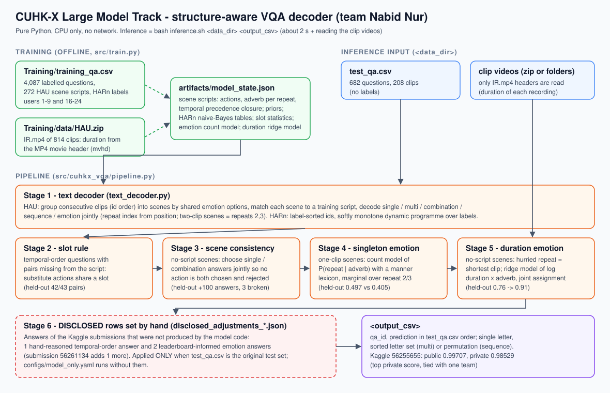

# CUHK-X Large Model Track: structure-aware decoding with clip durations

**Team Nabid Nur: top private score on the Kaggle leaderboard (0.98529), tied with one other team; Kaggle lists Nabid
Nur first.** Final placements, including the cash prizes, are decided by the Organizing Committee after verification
and the UbiComp 2026 finals, under the published scoring criteria.

| Submission (Kaggle ID) | What changed | Public (342 rows) | Private (340 rows) |
|---|---|---|---|
| v2 (56232279) | first structural text decoder, two-clip scenes as repeats 1 and 3 | 0.95321 | 0.92647 |
| v2_map12 (56232286) | leaderboard probe: repeats 1 and 2 (21 emotion answers differ) | 0.92397 | 0.92058 |
| v3 (56236009) | repeats 2 and 3, HARn fix, six hand-set temporal-order answers | 0.98245 | 0.97058 |
| v4 (56253165) | two row changes from coded solvers (test_0079, test_0430) | 0.98245 | 0.97058 |
| v5 (56255194) | high-variance emotion flips chosen by simulation | 0.97953 | 0.97352 |
| **v6 (56255655, Selected, primary)** | clip-duration emotion model | **0.99707** | **0.98529** |
| v7A (56261134, Selected) | v6 plus one leaderboard-informed row (test_0430) | 0.99707 | 0.98529 |

No vision-language model, GPU, API or neural network is used. The solution is about 1,400 lines of standard-library
Python and runs in seconds on a CPU. The team also made 23 earlier submissions in August with a different pipeline,
which is not described here.



## 1 What the data looks like

The competition provides 4,087 training questions and 682 test questions over 208 clips. Categories: single action,
multiple actions, action combination, temporal order, emotion (manner), HARn action and object. Read as data rather
than as isolated VQA items, the questions show strong structure:

- **Scenes and repeats.** HAU clips are named `user/x-y-z`: scene `x-y`, repeat `z`. The three repeats of a scene
  perform the same actions, each in a different manner, which the "emotion" question asks about. Every repeat's
  emotion options contain all three scene adverbs plus one distractor (189 of 195).
- **Twin scripts.** Training users 6-9 and 16-19 performed near-identical scene scripts:
  - action-set Jaccard 0.94-0.99;
  - the same adverb per repeat (193/193);
  - no temporal-order conflict (354 agreeing pairs, 0 conflicts).

  Several test participants re-perform training scripts.
- **Ordered ids.** `LM_test_NNNN` ids list the HARn clips first, sorted by label, then the HAU clips by participant,
  scene and repeat.
- **Distractors.** Single-question distractors are never scene actions (1 exception in 2,427), and neither are false
  multi-select options (1 in 1,729). In 782 of 790 training combination questions, every atom appears in exactly two
  of the four options.
- **Manner and time.** The hurried repeat of a scene is the shortest recording. In test scenes with a matched script,
  the fastest adverb went with the shortest clip in 37 of 39 scenes.

## 2 Method

### Stage 1: text decoder

1. Group consecutive clips into scenes by shared emotion options.
2. Score each scene against the 272 training scene scripts.
3. Decode all questions of the scene jointly:
   - **single:** the option inside the scene's action set;
   - **combination:** the option fully inside it;
   - **multi:** the options inside the action set;
   - **temporal order:** the permutation most consistent with the script's precedence closure and global pair counts;
   - **emotion:** the script's adverb for the clip's repeat index, or a repeat prior when no script matches.
4. HARn clips: a softly monotone dynamic programme over the sorted labels, with naive-Bayes option scores.

Held-out training users:

| Setting | Accuracy |
|---|---|
| Twin scenes, 3 repeats | 0.971 |
| Twin scenes, 2 repeats (depends on which repeat is missing) | 0.87-0.99 |
| Scenes without a script, 3 repeats | 0.863 |
| HARn | 0.994 |

### Stage 2: slot rule for temporal order

When the matched script never ordered two actions, actions that replace each other across repeats (for example
Reading and Turning a page) are treated as one slot. The unknown pair takes the slot's known order. This got 42 of
43 held-out missing pairs right. The rule was written after six temporal-order answers had been set by hand for v3,
and it reproduces five of them (section 4).

### Stage 3: joint scene consistency

In scenes without a matched script, all single and combination answers are chosen together, so that no action is
both chosen and rejected.

| Held-out scenes | Answers fixed | Answers broken |
|---|---|---|
| 3 repeats | 51 | 0 |
| 2 repeats | 52 | 3 |

### Stage 4: singleton emotion

For a one-clip scene, a count model of P(repeat | adverb), with a manner lexicon, is marginalised over repeats 2
and 3. Held-out accuracy was 0.497, against 0.405 for the stage-1 default.

### Stage 5: duration emotion model (from 0.982 to 0.997 public)

The duration of each clip is read from the MP4 movie header of its IR video, without decoding frames. A ridge
regression predicts within-scene log duration from the adverb's class, the adverb and the repeat index, fitted on
814 training clips. Each assignment of the scene's adverbs to its clips is scored as
`log P(adverb | repeat) + log-likelihood(durations)`.

| Evaluation | Before | After |
|---|---|---|
| Held-out users without a twin (leave-one-group-out), 3 repeats | 0.819 | 0.922 |
| Held-out users without a twin (leave-one-group-out), 2 repeats | 0.760 | 0.913 |
| Test scenes with a matched script, decoded without it, scored against the script's adverbs | 0.796 | 0.959 |

The test-scene check scored against the scripts' adverbs, which are not ground truth. It drops to 0.939 when the
script owners' training clips are removed, and it was also used when fixing the duration weight.

On the test set, the model changes 13 emotion answers in six scenes of the one participant without a twin script,
who often performs the hurried repeat second. Submission v6 contains 11 of these changes. In scene
LM_test_0158-0160 it follows the model's second-ranked hypothesis instead (section 4).

## 3 What did not work

- **The emotion distractor.** Picking the answer from its relation to the distractor: 0.335, which is chance.
- **LLM judges.** Claude agents assigned probabilities to answer hypotheses for held-out training look-alikes and for
  test questions. On the look-alikes they did not beat the calibrated algorithms for emotion or action questions,
  and helped only on temporal order. Their outputs were used for submission v5, which is not Selected.
- **Negative evidence from twin scripts.** Changes netted 0 in the matching simulations.
- **High-variance flip sets.** Choosing text-only emotion flips to maximise the chance of a public gain lost 1 public
  question (v5).
- **Video bitrate as a motion proxy.** It separated hurried clips less well than duration (Thermal 31/37, IR 29/38)
  and is not used by the model code. It was one input to the hand-chosen test_0430 answer of v7A.

## 4 Disclosure and limitations

- **Answers set by hand.**
  - In v6: test_0358 (a temporal-order answer set with an AI assistant) and test_0681 / test_0423 (choosing between
    two near-tied duration-model hypotheses using v5's public score).
  - v7A adds test_0430.
  - Five further temporal-order answers were set by hand for v3 before the slot rule that now reproduces them existed.

  All are listed with explanations in `artifacts/disclosed_adjustments_*.json`.
- **Public-leaderboard use.** Leaderboard feedback determined:
  - the repeat indices of two-clip scenes (probe v2_map12);
  - the hypothesis for scene LM_test_0158-0160;
  - test_0430 in v7A;
  - keeping the hand-set temporal-order answers.
- **AI assistance.** Claude (Anthropic) agents read the label-free test questions, wrote and validated the rules, and
  proposed answers for individual test rows during development. No LLM or API is used at inference.
- **Code provenance.** The submissions were produced by research scripts during the competition. The published code
  is a post-deadline consolidation that reproduces both Selected CSVs byte for byte.
- **Generalisation.** The method exploits how this test set was built: re-performed scripts, clip order and the
  three-manner structure. It will generalise poorly to data built differently; the code still runs there and falls
  back to text priors.
- **Data.** No test ground-truth labels, external datasets or pretrained models were used. Clip durations came from
  the official videos, via the organisers' public Google Drive mirror.

## 5 Reproduce

```bash
python3 src/train.py --training-dir <CUHK-X Large-Model-Track Training dir>   # builds artifacts/model_state.json
bash inference.sh <Testing dir> submission.csv                               # reproduces Kaggle submission 56255655
```

## 6 Citation

Jiang et al., *A Large-Scale Multimodal Dataset and Benchmarks for Human Activity Scene Understanding and Reasoning*,
MobiSys 2026, DOI 10.1145/3745756.3809209. Dataset by the AIoT Lab, Department of Information Engineering, CUHK.
